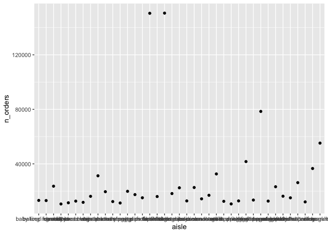

p8105\_hw3\_by2287
================
Binyam Yilma

#### Setup

``` r
library(tidyverse)

library(p8105.datasets)
data("instacart")
```

The dataframe `instacart` is made up of 1384617 rows and 15 columns, and
it contains information on grocery orders from 131209 unique customers.
There are 131209 unique products in this dataset.

Some key variables in `instacart` include: the `order_id` for a
particular order, and an identifier for the each customer in `user_id`,
the names of different products in `product_name`, as well as the
`order_hour_of_day`, which has a range of: 0, 23.

How many aisles are there, and which aisles are the most items ordered
from?

There are 134 unique aisles.

These are the top 3 most ordered from aisles.

| aisle                      | n\_orders |
| :------------------------- | --------: |
| fresh vegetables           |    150609 |
| fresh fruits               |    150473 |
| packaged vegetables fruits |     78493 |

1 - Make a plot that shows the number of items ordered in each aisle,
limiting this to aisles with more than 10000 items ordered. Arrange
aisles sensibly, and organize your plot so others can read it.

``` r
instacart %>% 
  group_by(aisle) %>% 
  summarise(n_orders = n()) %>% 
  arrange(desc(n_orders)) %>% 
  filter(n_orders > 10000) %>% 
  ggplot(aes(x = aisle, y = n_orders)) + 
  geom_point()
```

    ## `summarise()` ungrouping output (override with `.groups` argument)

<!-- -->

2 - Make a table showing the three most popular items in each of the
aisles “baking ingredients”, “dog food care”, and “packaged vegetables
fruits”. Include the number of times each item is ordered in your table.

3 - Make a table showing the mean hour of the day at which Pink Lady
Apples and Coffee Ice Cream are ordered on each day of the week; format
this table for human readers (i.e. produce a 2 x 7 table).
