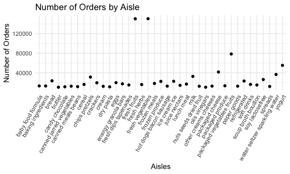
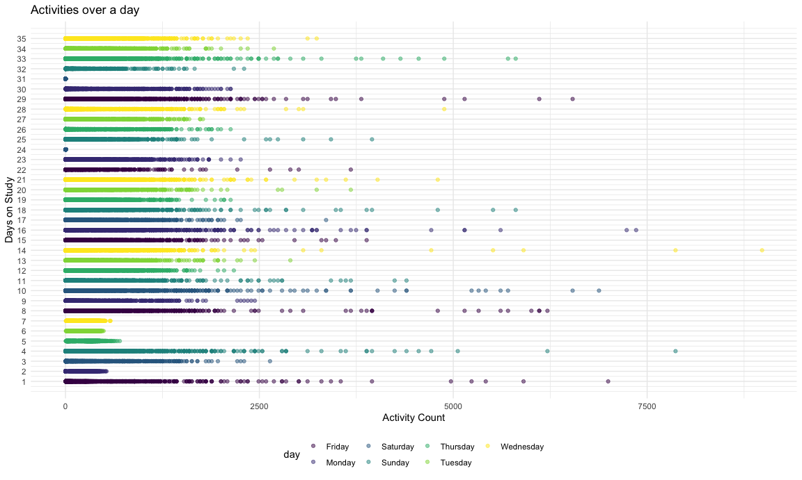
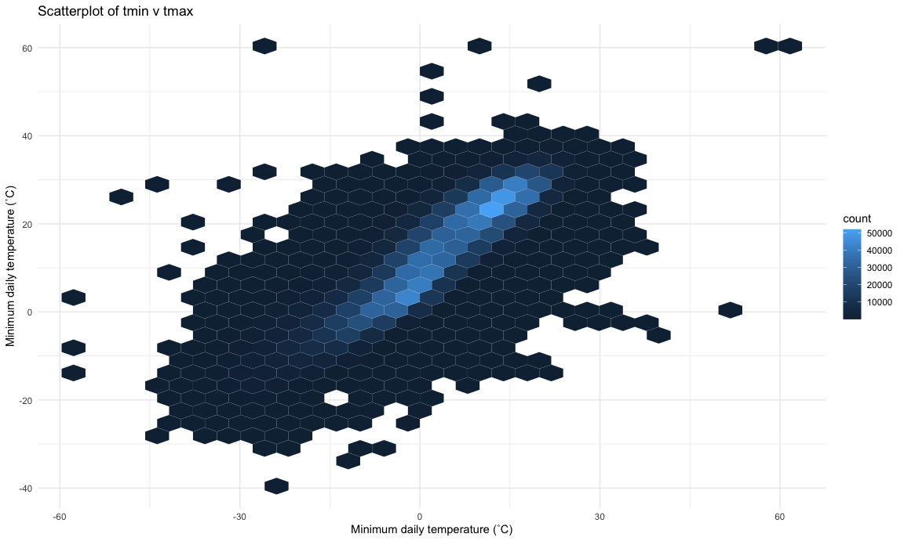

p8105\_hw3\_by2287
================
Binyam Yilma

#### Setup

The dataframe `instacart` is made up of 1384617 rows and 15 columns, and
it contains information on grocery orders from 131209 unique customers.
There are 131209 unique products in this dataset.

Some key variables in `instacart` include: the `order_id` for a
particular order, and an identifier for the each customer in `user_id`,
the names of different products in `product_name`, as well as the
`order_hour_of_day`, which has a range of: 0, 23.

How many aisles are there, and which aisles are the most items ordered
from?

There are 134 unique aisles.

These are the top 3 most ordered from aisles.

| aisle                      | n\_orders |
| :------------------------- | --------: |
| fresh vegetables           |    150609 |
| fresh fruits               |    150473 |
| packaged vegetables fruits |     78493 |

A plot that shows the number of items ordered in each aisle (looking at
only aisles with \> 10000 orders), limiting this to aisles with more
than 10000 items ordered.

``` r
instacart %>% 
  group_by(aisle) %>% 
  summarise(n_orders = n()) %>% 
  arrange(desc(n_orders)) %>% 
  filter(n_orders > 10000) %>% 
  ggplot(aes(x = aisle, y = n_orders)) + 
  geom_point() + 
  theme(axis.text.x = element_text(angle = 60, vjust = 1.0, hjust = 1))
```



The three most popular items in the aisles “baking ingredients”, “dog
food care”, and “packaged vegetables fruits”:

``` r
instacart %>% 
  filter(aisle %in% c("baking ingredients", "dog food care", "packaged vegetables fruits")) %>% 
  group_by(aisle) %>% 
  count(product_name) %>% 
  mutate(
    rank = min_rank(desc(n))
      ) %>% 
  filter(rank %in% c(1,2,3)) %>% 
  arrange(aisle, rank) %>% 
  knitr::kable()
```

| aisle                      | product\_name                                 |    n | rank |
| :------------------------- | :-------------------------------------------- | ---: | ---: |
| baking ingredients         | Light Brown Sugar                             |  499 |    1 |
| baking ingredients         | Pure Baking Soda                              |  387 |    2 |
| baking ingredients         | Cane Sugar                                    |  336 |    3 |
| dog food care              | Snack Sticks Chicken & Rice Recipe Dog Treats |   30 |    1 |
| dog food care              | Organix Chicken & Brown Rice Recipe           |   28 |    2 |
| dog food care              | Small Dog Biscuits                            |   26 |    3 |
| packaged vegetables fruits | Organic Baby Spinach                          | 9784 |    1 |
| packaged vegetables fruits | Organic Raspberries                           | 5546 |    2 |
| packaged vegetables fruits | Organic Blueberries                           | 4966 |    3 |

The mean hour of the day at which Pink Lady Apples and Coffee Ice Cream
are ordered on each day of the week:

``` r
instacart %>% 
  filter(product_name %in% c("Pink Lady Apples", "Coffee Ice Cream")) %>% 
  group_by(product_name, order_dow) %>% 
  summarise(mean_hour = mean(order_hour_of_day)) %>% 
  pivot_wider(
        names_from = order_dow,
        values_from = mean_hour
    ) %>% 
  knitr::kable(digits = 2)
```

| product\_name    |     0 |     1 |     2 |     3 |     4 |     5 |     6 |
| :--------------- | ----: | ----: | ----: | ----: | ----: | ----: | ----: |
| Coffee Ice Cream | 13.77 | 14.32 | 15.38 | 15.32 | 15.22 | 12.26 | 13.83 |
| Pink Lady Apples | 13.44 | 11.36 | 11.70 | 14.25 | 11.55 | 12.78 | 11.94 |

Problem 2

Load, tidy, and otherwise wrangle the data. Your final dataset should
include all originally observed variables and values; have useful
variable names; include a weekday vs weekend variable; and encode data
with reasonable variable classes. Describe the resulting dataset
(e.g. what variables exist, how many observations, etc). Traditional
analyses of accelerometer data focus on the total activity over the day.
Using your tidied dataset, aggregate accross minutes to create a total
activity variable for each day, and create a table showing these totals.
Are any trends apparent? Accelerometer data allows the inspection
activity over the course of the day. Make a single-panel plot that shows
the 24-hour activity time courses for each day and use color to indicate
day of the week. Describe in words any patterns or conclusions you can
make based on this graph.

## Problem 2

``` r
accel = read_csv("./data/accel_data.csv") %>% 
  janitor::clean_names() 
```

    ## Parsed with column specification:
    ## cols(
    ##   .default = col_double(),
    ##   day = col_character()
    ## )

    ## See spec(...) for full column specifications.

``` r
accel_tidy = accel %>%
  pivot_longer(
    cols = activity_1:activity_1440, 
    names_to = "activity_id", 
    names_prefix = "activity_",
    values_to = "activity_count"
    ) %>% 
  mutate(
    day_type = case_when(
      day %in% c("Saturday","Sunday") ~ "Weekend",
      TRUE ~ "Weekday"
    ), 
    day_id = as.integer(day_id),
    week = as.integer(week),
    activity_id = as.integer(activity_id),
    day = factor(day)
  ) %>% 
  relocate(day_id, day, day_type, week)
```

The dataset `accel_tidy` is a tidy version of the `accel` dataset,
imported in the above code chunk.

`accel_tidy` has 50400 rows and 6 columns, and it includes these
variables: day\_id, day, day\_type, week, activity\_id, activity\_count.

These variables are collected from an accelerometer, which was worn by a
63 year-old male, and contain minute by minute information on 1440
different types of activities, measured for each day over 5 weeks.

Traditional analyses of accelerometer data focus on the total activity
over the day. Using your tidied dataset, aggregate accross minutes to
create a total activity variable for each day, and create a table
showing these totals. Are any trends apparent?

#### total activity over a given day

``` r
accel_tidy %>% 
  group_by(day_id, day, day_type) %>% 
  summarise(
    total_activity = sum(activity_count)
  ) %>% 
  arrange(day_id) %>% 
  knitr::kable(digits = 2)
```

    ## `summarise()` regrouping output by 'day_id', 'day' (override with `.groups` argument)

| day\_id | day       | day\_type | total\_activity |
| ------: | :-------- | :-------- | --------------: |
|       1 | Friday    | Weekday   |       480542.62 |
|       2 | Monday    | Weekday   |        78828.07 |
|       3 | Saturday  | Weekend   |       376254.00 |
|       4 | Sunday    | Weekend   |       631105.00 |
|       5 | Thursday  | Weekday   |       355923.64 |
|       6 | Tuesday   | Weekday   |       307094.24 |
|       7 | Wednesday | Weekday   |       340115.01 |
|       8 | Friday    | Weekday   |       568839.00 |
|       9 | Monday    | Weekday   |       295431.00 |
|      10 | Saturday  | Weekend   |       607175.00 |
|      11 | Sunday    | Weekend   |       422018.00 |
|      12 | Thursday  | Weekday   |       474048.00 |
|      13 | Tuesday   | Weekday   |       423245.00 |
|      14 | Wednesday | Weekday   |       440962.00 |
|      15 | Friday    | Weekday   |       467420.00 |
|      16 | Monday    | Weekday   |       685910.00 |
|      17 | Saturday  | Weekend   |       382928.00 |
|      18 | Sunday    | Weekend   |       467052.00 |
|      19 | Thursday  | Weekday   |       371230.00 |
|      20 | Tuesday   | Weekday   |       381507.00 |
|      21 | Wednesday | Weekday   |       468869.00 |
|      22 | Friday    | Weekday   |       154049.00 |
|      23 | Monday    | Weekday   |       409450.00 |
|      24 | Saturday  | Weekend   |         1440.00 |
|      25 | Sunday    | Weekend   |       260617.00 |
|      26 | Thursday  | Weekday   |       340291.00 |
|      27 | Tuesday   | Weekday   |       319568.00 |
|      28 | Wednesday | Weekday   |       434460.00 |
|      29 | Friday    | Weekday   |       620860.00 |
|      30 | Monday    | Weekday   |       389080.00 |
|      31 | Saturday  | Weekend   |         1440.00 |
|      32 | Sunday    | Weekend   |       138421.00 |
|      33 | Thursday  | Weekday   |       549658.00 |
|      34 | Tuesday   | Weekday   |       367824.00 |
|      35 | Wednesday | Weekday   |       445366.00 |

``` r
  # ggplot(aes(x = day_id, y = total_activity)) + 
  # geom_point(alpha = .5) + 
  # geom_smooth(se = F) + 
  # theme(axis.text.x = element_text(angle = 60, vjust = 1.0, hjust = 1))
```

It’s hard to spot any trends in the data, in specific the total activity
per day, from the table only.

Worth noting here, is that there a couple of Saturday’s where the
subject’s activity level was exactly 1440.0 (perhaps an artifact of the
accelerometer?).

#### Graph showing the 24-hour activity time courses for each day

``` r
accel_tidy %>% 
  ggplot(aes(y = day_id, x = activity_count, color = day)) + 
  geom_point(alpha = .5) + 
  scale_y_continuous(
    breaks = c(1:35)
    ) 
```



## Problem 3

``` r
ny_noaa_tidy = ny_noaa %>% 
  separate(date, into = c("year", "month", "day")) %>% 
  mutate(
    snow = snow/10,
    tmax = as.integer(tmax)/10,
    tmin = as.integer(tmin)/10,
    prcp = prcp/10, 
    month = as.integer(month),
    month = month.name[month]
    )
```

The dataset `ny_noaa` has 2595176 rows and 7 columns, and as it is, it
includes the following variables: id, date, prcp, snow, snwd, tmax,
tmin. It contains informaiton collected from 747 unique weather
stations.

Tidy-ing the ny\_noaa dataset

``` r
ny_noaa_tidy %>% 
  count(snow, name = "n_of_days") %>% 
  arrange(desc(n_of_days)) %>% 
  rename(snow_in_mm = snow) %>% 
  head(3) %>% 
  knitr::kable()
```

| snow\_in\_mm | n\_of\_days |
| -----------: | ----------: |
|          0.0 |     2008508 |
|           NA |      381221 |
|          2.5 |       31022 |

The most commonly observed values for snow fall is `0`, coming in at
2008508 observations. This is followed by `NA` values, and `25 mm` of
snow. I believe this is because days covered in the `ny_noaa` dataset
see more no\_snow days than they actually see snow days.

``` r
ny_noaa_tidy %>% 
  filter(month %in% c("July", "January") & tmax != "") %>% 
  group_by(year, month) %>% 
  summarise(
    mean_tmax = mean(tmax)
  ) %>% 
  ggplot(aes(x = year , y = mean_tmax, color = month)) + 
  geom_point(alpha = 2) + 
  geom_smooth(se = F) + 
  facet_grid(. ~ month)
```

    ## `summarise()` regrouping output by 'year' (override with `.groups` argument)

    ## `geom_smooth()` using method = 'loess' and formula 'y ~ x'


The average `tmax` in July has stayed more or less the same. However the
average `tmax` for January saw a big increase in the 1980’s. It’s
noteable how in both instances, the variability tended to increase as
the years went by.

Make a two-panel plot showing: tmax vs tmin for the full dataset

``` r
ny_noaa_tidy %>% 
  filter(tmin != "" & tmax != "" ) %>% 
  ggplot(aes(x = tmin, y = tmax)) + 
  geom_hex() + 
  theme(legend.position = "right")
```



Make a plot showing the distribution of snowfall values greater than 0
and less than 100 separately by year.

``` r
ny_noaa_tidy %>% 
  filter(snow > 0 & snow < 100 & snow != "") %>% 
  ggplot(aes(y = year, x = snow, fill = year)) + 
  ggridges::geom_density_ridges()
```

    ## Picking joint bandwidth of 0.622


